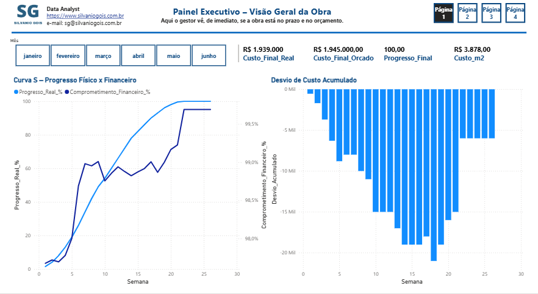
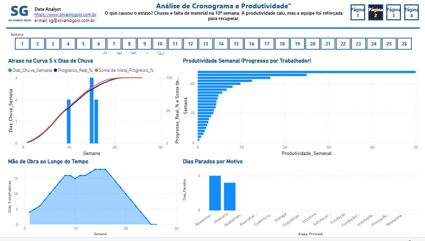
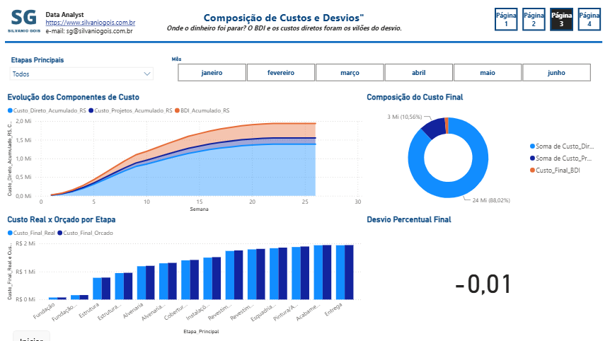
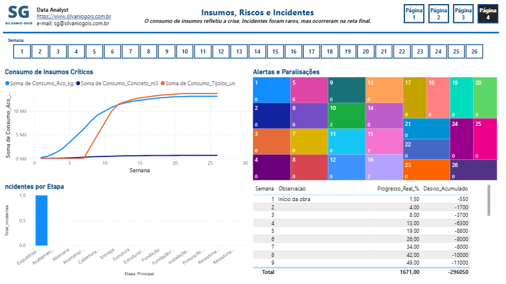

# 🏗️ Dashboard de Gestão de Obras – Do Planejamento à Entrega

**Autor:** Silvanio Gois – Gestor de Operações e Negócios Orientado a Dados  
🔗 [Portfólio](https://www.silvaniogis.com.br) · [LinkedIn](https://www.linkedin.com/in/silvanio-gois-6667b918b) · [GitHub](https://github.com/SilvanioSG)

---

## 📊 Acesse o Dashboard Online
👉 [Power BI Service – Painel Interativo](https://app.powerbi.com/view?r=eyJrIjoiYmRiNmI3MjMtYjNmMS00NjgxLTljZjYtNzY3N2ExZTg1ZTA3IiwidCI6IjJlYmQyYzU0LWY1ZDMtNGVmYi05ZGE3LWU4Yzk0YmQyMWQzOSJ9)

---

## 📌 Sobre o Projeto

Este projeto de Business Intelligence foi desenvolvido para simular o acompanhamento de uma obra residencial de **500 m²** em São Paulo, padrão médio, com prazo de **6 meses** e orçamento total de **R$ 1,945 milhão**. O objetivo é demonstrar, na prática, como um gestor de obras pode usar dados para **monitorar progresso, desvios de custo, produtividade da mão de obra, consumo de insumos e incidentes**, tomando decisões baseadas em evidências.

---

## 🧱 Base de Dados – Construída com Referências Técnicas

Diferente de datasets genéricos, esta base foi **construída manualmente** com lastro em fontes reais da construção civil:

- **CUB/SindusCon** – Custo Unitário Básico para definir o custo direto por m².
- **SINAPI** – Composições de serviços e preços de insumos (aço, concreto, tijolos, mão de obra).
- **EAP (Estrutura Analítica do Projeto)** – Hierarquia de etapas: Fundação, Estrutura, Alvenaria, Instalações, Cobertura, Revestimentos, Esquadrias, Pintura/Acabamentos.
- **BDI (Benefícios e Despesas Indiretas)** – Aplicado sobre custos diretos e projetos (25%).
- **Coeficientes de produtividade** – Convertidos em dias de trabalho e dimensionamento de equipe.

### Composição do Orçamento (valores aproximados)

| Componente | Valor (R$) | % do Total |
| :--- | :--- | :--- |
| Custo Direto (CUB) | 1.100.000 | 56,5% |
| Projetos (12%) | 132.000 | 6,8% |
| BDI (25%) | 308.000 | 15,8% |
| Taxas e Aprovações (3%) | 37.000 | 1,9% |
| Contingência | 62.000 | 3,2% |
| **Total Orçado** | **1.639.000** | **100%** |

Os dados simulam o dia a dia da obra, com eventos realistas: **chuvas, falta de materiais, reforço de equipe e incidentes leves**.

---

## 📈 O Dashboard – 4 Páginas de Análise

### 1. Painel Executivo – Visão Geral da Obra


**O que o gestor vê de imediato:**  
- Cartões com **custo total real, custo orçado, progresso final e custo por m²**.
- **Curva S** comparando o progresso físico (real) com o comprometimento financeiro (gasto).
- **Desvio de custo acumulado** ao longo das semanas.

**Insight:** A curva de comprometimento financeiro sempre esteve à frente da curva de progresso, indicando gastos antecipados. O desvio acumulado só se estabilizou na reta final.

---

### 2. Análise de Cronograma e Produtividade


**O que causou o atraso?**  
- Gráfico de **Curva S x Dias de Chuva** mostra que nas semanas 10 e 15 o progresso descolou da meta devido a chuvas e falta de material.
- **Produtividade semanal (progresso por trabalhador)** caiu exatamente nessas semanas.
- **Mão de obra ao longo do tempo** – a equipe foi reforçada de 15 para 18 trabalhadores para recuperar o atraso.
- **Dias parados por motivo** – alvenaria foi a etapa mais afetada.

**Insight:** A crise da semana 10 (falta de tijolos + chuva) gerou um atraso que só foi recuperado com aumento de equipe e gestão de estoque.

---

### 3. Composição de Custos e Desvios


**Onde o dinheiro foi parar?**  
- **Evolução dos componentes de custo** (Custo Direto, Projetos, BDI) ao longo do tempo.
- **Composição final de custos** – gráfico de rosca mostrando que 71% do total foi custo direto, 20% BDI e 9% projetos.
- **Custo real x orçado por etapa** – Estrutura e Alvenaria tiveram os maiores estouros.
- **Desvio percentual final** – apenas **0,3%** acima do orçado (R$ 6.000).

**Insight:** O desvio veio principalmente do BDI e do custo direto (mão de obra extra e compra emergencial de tijolos). Apesar disso, a obra terminou muito próxima do orçado.

---

### 4. Insumos, Riscos e Incidentes


**O consumo de insumos refletiu a crise.**  
- **Consumo de insumos críticos** (aço, concreto, tijolos) – pico de tijolos na semana 10 (falta de material).
- **Alertas e paralisações** – visualização das semanas com chuva e falta de material.
- **Incidentes por etapa** – apenas 1 incidente leve registrado na etapa de esquadrias/pintura.
- **Linha do tempo de eventos** – tabela que conta a história cronológica da obra.

**Insight:** A gestão de estoque foi o ponto crítico. Incidentes foram raros, o que indica bom controle de segurança.

---

## 🛠️ Medidas DAX Criadas (Principais)

```dax
// Visão Geral
Custo_Final_Real = CALCULATE(MAX('Obra'[Custo_Total_Acumulado_RS]); LASTDATE('Obra'[Data]))
Custo_Final_Orcado = CALCULATE(MAX('Obra'[Orcado_Total_Acumulado_RS]); LASTDATE('Obra'[Data]))
Progresso_Final = CALCULATE(MAX('Obra'[Progresso_Real_%]); LASTDATE('Obra'[Data]))
Custo_m2 = DIVIDE([Custo_Final_Real]; 500)
Comprometimento_Financeiro_% = DIVIDE(MAX('Obra'[Custo_Total_Acumulado_RS]); MAX('Obra'[Orcado_Total_Acumulado_RS]))
Desvio_Acumulado = SUM('Obra'[Custo_Total_Acumulado_RS]) - SUM('Obra'[Orcado_Total_Acumulado_RS])

// Cronograma
Produtividade_Semanal = DIVIDE(MAX('Obra'[Progresso_Real_%]); MAX('Obra'[Qtde_Trabalhadores]))
Dias_Parados = SUM('Obra'[Dias_Chuva_Semana]) + (COUNTROWS(FILTER('Obra'; 'Obra'[Falta_Material] = "Sim")) * 2)

// Custos
Custo_Final_Direto = CALCULATE(MAX('Obra'[Custo_Direto_Acumulado_RS]); LASTDATE('Obra'[Data]))
Custo_Final_Projetos = CALCULATE(MAX('Obra'[Custo_Projetos_Acumulado_RS]); LASTDATE('Obra'[Data]))
Custo_Final_BDI = CALCULATE(MAX('Obra'[BDI_Acumulado_RS]); LASTDATE('Obra'[Data]))
Desvio_Percentual_Final = DIVIDE([Desvio_Acumulado]; [Custo_Final_Orcado])

// Insumos
Total_Incidentes = SUM('Obra'[Incidentes_Semana])
Consumo_Final_Aco = CALCULATE(MAX('Obra'[Consumo_Aco_kg]); LASTDATE('Obra'[Data]))
Consumo_Final_Concreto = CALCULATE(MAX('Obra'[Consumo_Concreto_m3]); LASTDATE('Obra'[Data]))
Consumo_Final_Tijolos = CALCULATE(MAX('Obra'[Consumo_Tijolos_un]); LASTDATE('Obra'[Data]))